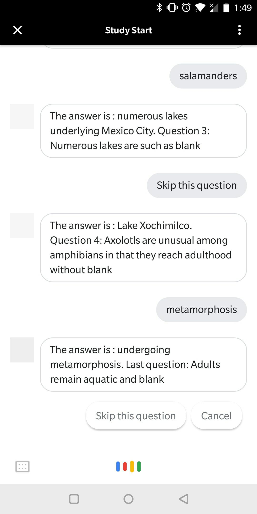

# StudyStart
Study faster and smarter!

StudyStart generates questions based on your notes and quizzes you on content you may have missed. You can access StudyStart from almost anywhere - **Slack, SMS and Google Assistant**.

## Demo
While we haven't published any of StudyStart's integrations publically, here is a preview of what it looks like:

## About
StudyStart has two components, a smart conversational agent engine built on DialogFlow and a Python backend using NLTK to analyze text and generate facts.

### DialogFlow Agent
* Available on multiple platforms for easy access, this conversational agent recognizes what the user wants to study and guides the user through a quiz-style conversation using questions and answers from a Firebase Real-Time Database.
* Accessible as a slackbot, Google Assistant action, or through SMS (Twilio)

### Python Backend
* Built on Flask, deployed on an AWS LightSail instance
* Makes use of AWS environment for heavy processing (NLP to extract facts and connvert them to questions)
* Uses NLTK to generate questions from facts

### Full Tech Stack
* Python & Flask
* Node.js
* [NLTK](https://www.nltk.org/)
* [Simplified Factual Statement Extractor](https://www.cs.cmu.edu/~ark/mheilman/qg-2010-workshop/)
* [DialogFlow Agent Fulfillment Library (Alpha)](https://github.com/dialogflow/dialogflow-fulfillment-nodejs)
* Google DialogFlow for integrations with Actions on Google, Slack, Twilio
* Google Firebase Services (Cloud Functions, Realtime Database)
* AWS (LightSail, EC2, S3)
* Various Node and Python libraries

### Next Steps
* Convert notes to text automatically from an image 
* Separate users and have individual accounts
* Find facts from the Internet for topics that are not yet in the database